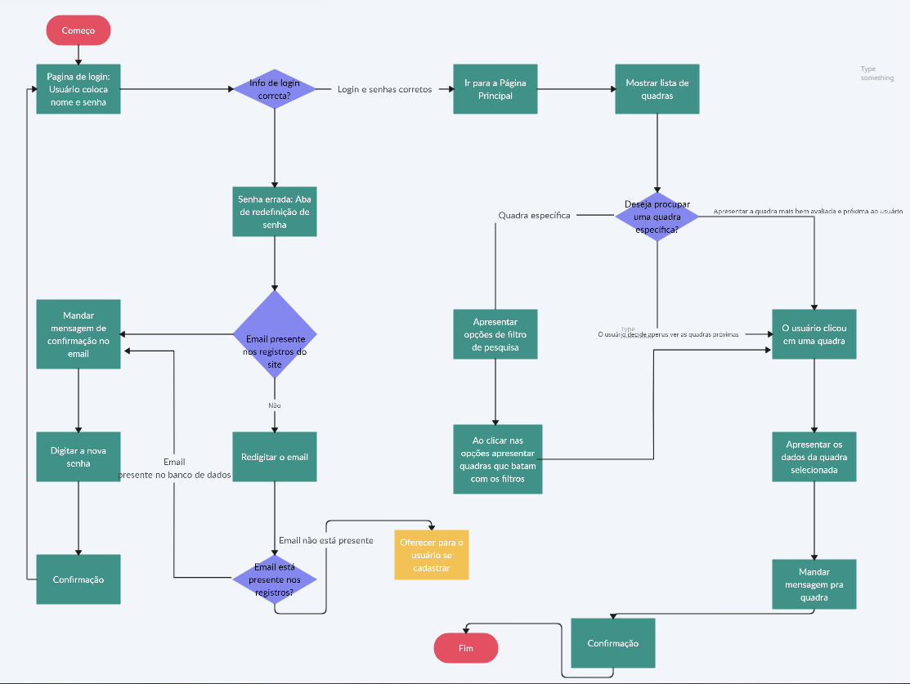
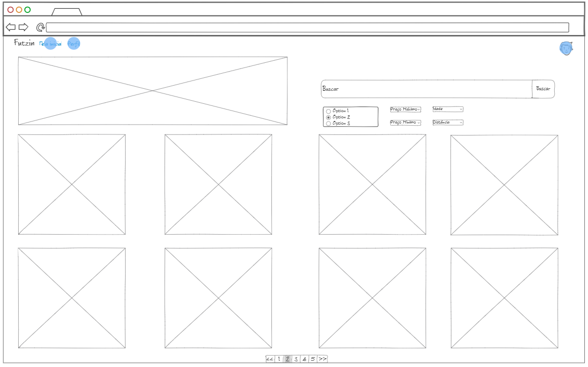

# Projeto de Interface
A partir das histórias de nossos usuários, definimos as principais necessidades e dificuldades ao achar uma pelada de futebol para jogar, como a imagem, preço, distância
e até mesmo a avaliação pelos próprios usuários, a partir de filtros na hora de se pesquisar.
## User Flow

## Wireframes

